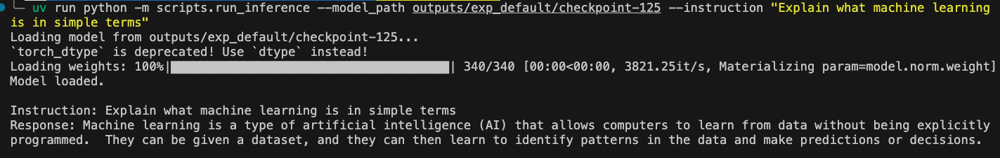

# Fine-Tuning Gemma 3 1B on GCP

A hands-on codebase for fine-tuning Gemma 3 1B on the Dolly-15k instruction dataset using LoRA on GCP, accompanying the [AIMS GCP Tutorial](https://rexsimiloluwah.github.io/gcp-tutorial-aims).

## Tools Used

- [uv](https://astral.sh/uv) — Python package and environment management
- [PyTorch](https://pytorch.org) — Deep learning framework
- [HuggingFace Transformers](https://huggingface.co/docs/transformers) — Model loading and training
- [PEFT](https://huggingface.co/docs/peft) — LoRA fine-tuning
- [Hydra](https://hydra.cc) — Configuration management
- [Weights & Biases](https://wandb.ai) — Experiment tracking
- [Google Cloud Storage](https://cloud.google.com/storage) — Dataset and output storage

## File Structure
```
.
├── data/
│   ├── raw/                  # Raw Dolly-15k dataset
│   └── eval/                 # Evaluation prompts
├── scripts/
│   ├── create_vm.sh          # GCP VM provisioning script
│   ├── download_and_upload_gcs.sh  # Dataset upload to GCS
│   ├── run_train.py          # Training entry point
│   ├── run_evaluate.py       # Evaluation entry point
│   └── run_inference.py      # Inference entry point
├── src/
│   ├── train.py              # Training logic
│   ├── evaluate.py           # Evaluation logic
│   ├── inference.py          # Inference logic
│   ├── configs/              # Hydra configuration files
│   │   ├── base.yaml
│   │   ├── lora_rank16.yaml
│   │   └── lora_rank32.yaml
│   └── utils/
│       ├── data_utils.py
│       ├── device_utils.py
│       ├── logger.py
│       └── metrics.py
├── .env.example
├── pyproject.toml
└── uv.lock
```

## Getting Started

**Clone the repo**
```bash
git clone https://github.com/rexsimiloluwah/finetuning-gemma-1b-aims-gcp-tutorial.git
cd finetuning-gemma-1b-aims-gcp-tutorial
```

**Set up the environment**
```bash
uv venv --python 3.12
uv sync
```

**Configure environment variables**
```bash
cp .env.example .env
nano .env
```

Fill in the following:
```bash
HF_TOKEN=your_huggingface_token
WANDB_API_KEY=your_wandb_api_key
WANDB_PROJECT=gemma-finetune
BUCKET_NAME=your_gcs_bucket_name
```

> Gemma 3 is a gated model. Before your token will work you must visit [huggingface.co/google/gemma-3-1b-it](https://huggingface.co/google/gemma-3-1b-it) and accept the license agreement.

## Training

**Upload dataset to GCS first**
```bash
uv run bash scripts/download_and_upload_gcs.sh
```

**Run training**
```bash
uv run python -m scripts.run_train \
    data.source=gcs \
    data.max_train_samples=10000 \
    training.num_epochs=2 \
    training.batch_size=8 \
    experiment_id=exp_lora_r8
```

All arguments correspond to values in `src/configs/base.yaml` and can be overridden from the command line. See the config files for the full list of available options.

## Evaluation
```bash
uv run python -m scripts.run_evaluate \
    --model_path outputs/<experiment_id>/<checkpoint_folder> \
    --eval_file data/eval/eval_prompts.jsonl \
    --max_eval_samples 200
```

## Inference

**Single instruction**
```bash
uv run python -m scripts.run_inference \
    --model_path outputs/<experiment_id>/<checkpoint_folder> \
    --instruction "Explain what machine learning is in simple terms"
```

**Interactive mode**
```bash
uv run python -m scripts.run_inference \
    --model_path outputs/<experiment_id>/<checkpoint_folder>
```




## Contributing

This codebase is open-source and contributions are welcome. If you find a bug, have a suggestion, or want to add something, please open an issue or submit a pull request.